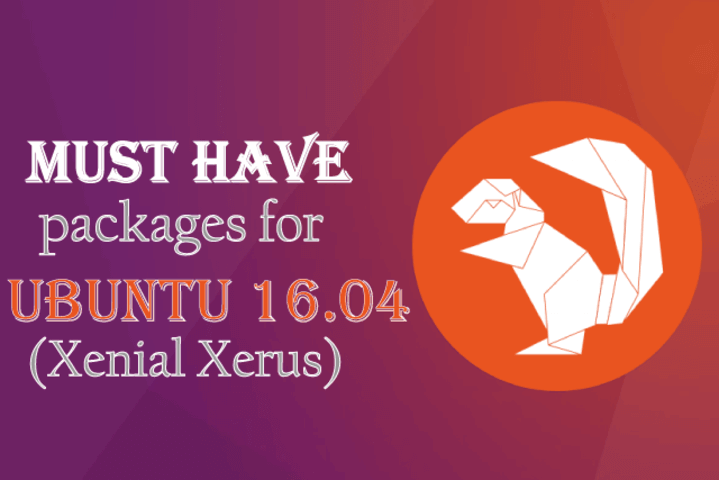
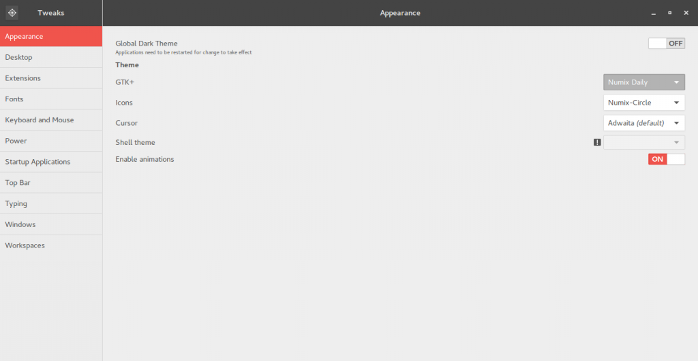

HHello Ubuntu Folks
So, Ubuntu 16.04 GNOME has been out there for quite a long time now. If you haven't upgraded, I see no reason why you haven't upgraded your distro to 16.04. Plus its a LTS, and supported for 3 years. If you're running 15.xx chances are, you cannot update your packages officially, as its dead now. That's not going to be the case for 16.04 due to its Long time support.



Well, after installing and playing with various OSS and distros, I have compiled a list of things needs to be done to enhance the Ubuntu distribution for personal usage, which I have listed below. I hope this will save your time of going through various sources for install scripts and testing to see if a package is good enough for usage or just some crappy software.

But before that if you are running an older distro, first go ahead and get a new one: [Ubuntu 16.04 GNOME](http://cdimage.ubuntu.com/ubuntu-gnome/releases/16.04/release/)

### Update and Upgrade software repositories

This will update all the existing packages to the latest bleeding edge software along with security updates.

```
sudo apt-get upgrade
sudo apt-get update

```

### Install Ubuntu Restricted Extras

This single command installs a collection of common utilities which are required by many media players, build files, packages etc.

```
sudo apt-get install ubuntu-restricted-extras

```

### Compression Utilities

You need it unless you're not going to deal with zips are rars again

```
sudo apt-get install unrar zip unzip

```

### VLC Media Player

Come on, everybody uses it

```
sudo apt-get install vlc browser-plugin-vlc

```

### Some extra plugins and codecs for video and audio

Believe me, your computer is going to need it at some time.

```
sudo apt install libavcodec-extra flashplugin-installer

```

### Install Guake

This is the best and last terminal, you're going to use. Just set a keymap to drop it down. And access terminal at your fingertips without ever lifting your hands off keyboard and without ever closing any terminal window. Plus, it supports tabs, that too with customizable keymaps. To make sure we get the latest one, we will use a unstable PPA.

```
  sudo add-apt-repository ppa:webupd8team/unstable
  sudo apt-get update
  sudo apt-get install guake

```

Add this to startup applications and you're done.

### Download your favourite browser

[Google Chrome Download](http://www.google.com/chrome‎)

```
sudo apt-get install firefox

```

### Vim Text Editor

Our powerful terminal text editor needs to be installed, because VI is the default one and that sucks. Lets upgrade it to mother of VI, the VIM

```
sudo apt-get install vim

```

### **Bonus**: Lets Style it Up

Numix is my favorite theme for GNOME, it makes the UI classy and cheerful. Circular-icons further enhance the look.

```
sudo add-apt-repository ppa:numix/ppa
sudo apt-get update
sudo apt-get install numix-gtk-theme numix-icon-theme-circle gnome-tweak-tool
gnome-tweak-tool

```

Open up Gnome tweak tool to change the theme from plain old ubuntu theme to flat style Numix-daily and icon-theme to Numix-circle. 

After doing so, this is how my Activities > Show All Applications Panel looks like: 

Cool, Right? Try these things out and let me know what you think about those. If you think I missed out any important ones out there, comment it out and I'll cover it up in an different post.

My Overall Experience with Ubuntu 16.04 Xenial Xerus has been pleasant till now, but a few bugs are always there along with workarounds. I hope Ubuntu Team is working hard to release patches for some irregular bugs and inconsistencies. Spread, share and help Ubuntu & OSS grow, after all its an community thing.